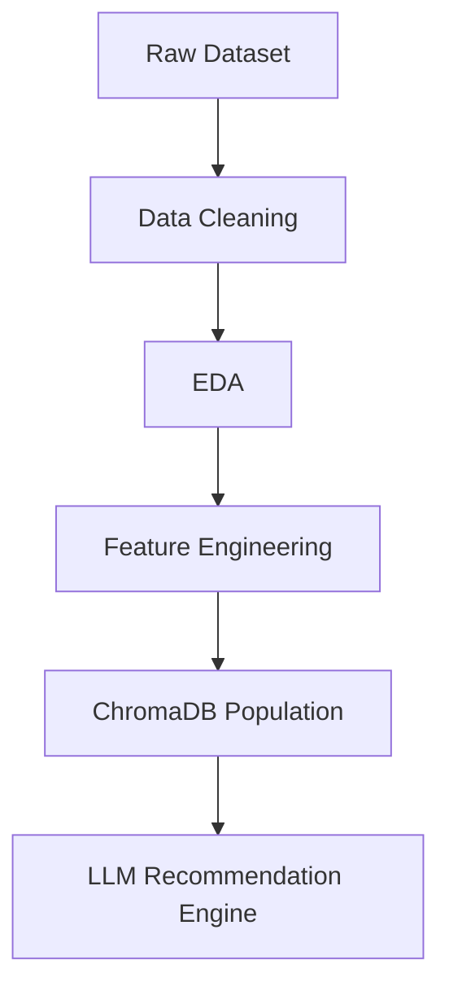

# Feature Engineering

## Overview

Feature engineering is the stage where raw smartphone specifications are transformed into normalized machine learning features that improve recommendation quality.

In this project, the original device attributes are converted into a structured feature set that helps the recommendation pipeline:

- compare phones across different price segments more fairly,
- capture strengths in hardware subsystems such as camera, performance, battery, and display,
- reduce noise from inconsistent or overly detailed raw specifications,
- provide a stable input space for downstream machine learning and LLM-based recommendation components.

The result is a cleaner and more meaningful representation of each Samsung phone, allowing the system to rank devices more accurately and consistently.

---

## Engineered Features

| Feature | Type | Description | Formula / Logic | Range |
|---|---|---|---|---|
| `RAM_GB` | Numeric | Total system memory available to the device. | Extracted and standardized from the raw RAM specification into gigabytes. | Typically `2–16+ GB` |
| `Storage_GB` | Numeric | Internal storage capacity available to the user. | Converted from raw storage specification into gigabytes. | Typically `16–1024 GB` |
| `Battery_mAh` | Numeric | Battery capacity of the device. | Standardized from the battery specification in milliamp-hours. | Typically `2000–6000 mAh` |
| `Screen_Size_Inch` | Numeric | Physical display size measured diagonally. | Parsed from the raw display specification and stored in inches. | Typically `5.0–7.2 inches` |
| `Refresh_Rate_Hz` | Numeric | Display refresh rate. | Extracted from the raw screen specification and standardized in hertz. | Typically `60–144 Hz` |
| `Main_Camera_MP` | Numeric | Resolution of the primary rear camera. | Extracted from the main camera specification in megapixels. | Typically `12–200 MP` |
| `UltraWide_MP` | Numeric | Resolution of the ultra-wide rear camera, if present. | Parsed from the ultra-wide camera specification; `0` if unavailable. | Typically `0–50 MP` |
| `Telephoto_MP` | Numeric | Resolution of the telephoto camera, if present. | Parsed from the telephoto camera specification; `0` if unavailable. | Typically `0–50 MP` |
| `Front_Camera_MP` | Numeric | Resolution of the front-facing camera. | Extracted from the selfie camera specification in megapixels. | Typically `5–60 MP` |
| `Launch_Year` | Numeric | Release year of the smartphone. | Derived from the device launch date or release metadata. | Typically `2017–2026` |
| `camera_score` | Engineered Score | Measures overall camera capability. | Weighted score based on main camera, ultra-wide camera, telephoto camera, and OIS support; normalized to a `0–10` scale. | `0–10` |
| `performance_score` | Engineered Score | Represents smartphone processing capability. | Computed from processor score, RAM, and storage; normalized to a `0–10` scale. | `0–10` |
| `battery_score` | Engineered Score | Represents battery endurance. | Computed from battery capacity and charging speed; normalized to a `0–10` scale. | `0–10` |
| `display_score` | Engineered Score | Measures display quality. | Computed from screen size and refresh rate; normalized to a `0–10` scale. | `0–10` |
| `durability_score` | Engineered Score | Represents device durability. | Based on waterproof certification and build quality indicators, when available; normalized to a `0–10` scale. | `0–10` |
| `ai_score` | Engineered Score | Measures AI capability. | Encoded using a categorical scale: `No AI = 0`, `Basic AI = 5`, `Galaxy AI = 10`. | `0`, `5`, `10` |
| `value_score` | Engineered Score | Measures value for money. | Capability score divided by a logarithmic price penalty, then Min-Max normalized to a `1–10` scale. Logarithmic scaling reduces the penalty for price increases at the premium end. | `1–10` |
| `recommendation_score` | Engineered Score | Final score used by the recommendation model. | `0.25 × Performance Score + 0.20 × Camera Score + 0.15 × Battery Score + 0.15 × Display Score + 0.10 × AI Score + 0.05 × Durability Score + 0.10 × Value Score` | `0–10` |

### Numeric Features

These features preserve core device specifications in a machine-readable format:

- `RAM_GB` captures multitasking headroom and memory capacity.
- `Storage_GB` reflects local storage availability and helps distinguish entry-level and flagship devices.
- `Battery_mAh` is a direct proxy for energy capacity.
- `Screen_Size_Inch` and `Refresh_Rate_Hz` describe the display experience.
- `Main_Camera_MP`, `UltraWide_MP`, `Telephoto_MP`, and `Front_Camera_MP` represent the device’s camera hardware configuration.
- `Launch_Year` helps the model account for product generation and technology maturity.

### Engineered Scores

#### `camera_score`

**Purpose:**

- Measures overall camera capability.

**Logic:**

- Uses weighted camera hardware components, including:
  - Main Camera
  - UltraWide Camera
  - Telephoto Camera
  - OIS support
- The final score is normalized to a `0–10` range.
- Devices with more versatile and higher-quality camera systems receive higher scores.

#### `performance_score`

**Purpose:**

- Represents smartphone processing capability.

**Logic:**

- Uses:
  - Processor Score
  - RAM
  - Storage
- The score reflects how well the device should handle multitasking, app loading, and long-term usability.
- The final output is normalized to a `0–10` range.

#### `battery_score`

**Purpose:**

- Represents battery endurance.

**Logic:**

- Uses:
  - Battery Capacity
  - Charging Speed
- Phones with larger batteries and faster charging capabilities receive higher scores.
- The final score is normalized to a `0–10` range.

#### `display_score`

**Purpose:**

- Measures display quality.

**Logic:**

- Uses:
  - Screen Size
  - Refresh Rate
- Higher refresh rates improve perceived smoothness, while screen size contributes to the overall viewing experience.
- The final score is normalized to a `0–10` range.

#### `durability_score`

**Purpose:**

- Represents device durability.

**Logic:**

- Uses:
  - Waterproof certification
  - Build quality indicators, if available
- Devices with stronger protection and premium materials receive higher scores.
- The final score is normalized to a `0–10` range.

#### `ai_score`

**Purpose:**

- Measures AI capability.

**Logic:**

- Encoded as a simple categorical feature:
  - `No AI = 0`
  - `Basic AI = 5`
  - `Galaxy AI = 10`
- This feature captures the presence and maturity of AI-assisted device functionality.

#### `value_score` (Optional / Omitted)

**Note on Price-based Value Scoring:**
- In the initial conceptual framework, a `value_score` was proposed to penalize price and measure relative cost-efficiency.
- However, since the raw Samsung specifications dataset does not include a `Price` column, **`value_score` is currently omitted** from the active pipeline. If price data is added in the future, it can be re-incorporated.

#### `recommendation_score`

**Purpose:**

- Final score used by the recommendation model.

**Formula:**

$$
\text{Recommendation Score} = 0.30 \times \text{Performance Score} + 0.25 \times \text{Camera Score} + 0.15 \times \text{Battery Score} + 0.15 \times \text{Display Score} + 0.10 \times \text{AI Score} + 0.05 \times \text{Durability Score}
$$

**Why these weights were selected:**

- **Performance (30%)** receives the highest weight because it strongly influences day-to-day responsiveness, gaming capability, and long-term usability.
- **Camera (25%)** is heavily prioritized because it is one of the most important purchase drivers for modern smartphone users.
- **Battery (15%)** and **Display (15%)** are assigned meaningful weights because they directly affect the daily user experience.
- **AI (10%)** is included to reflect modern Samsung device capabilities and ecosystem differentiation.
- **Durability (5%)** is given a smaller weight because it is important, but often less differentiating than core hardware features.

These weights are intentionally designed for the current version of the recommendation system and can be adjusted in future releases based on user feedback, offline evaluation metrics, and real-world recommendation performance.

---

## Why Feature Engineering Matters

Feature engineering improves the recommendation pipeline in several important ways:

- **Model accuracy**
  - Converts raw, heterogeneous specifications into structured signals that are easier for the model to learn from.
  - Reduces the impact of noisy or inconsistent raw labels.

- **Interpretability**
  - Makes it easier to explain why a phone was recommended.
  - Produces scores that can be understood by both technical and non-technical stakeholders.

- **Recommendation quality**
  - Highlights product strengths in a balanced way instead of relying on a single specification.
  - Helps the system rank phones more fairly across different price tiers.

- **Feature consistency**
  - Standardizes units and scales across the dataset.
  - Ensures that downstream modeling receives stable and comparable inputs.

---

## Future Improvements

The current feature set captures the most relevant hardware signals, but several additional features could improve future versions of the recommendation system:

- Software update policy
- Benchmark scores
- Thermal performance
- Wireless charging
- Reverse charging
- Battery health
- Display brightness
- Camera sensor size
- Optical zoom
- Video recording quality
- Repairability score
- Sustainability score

These additions would make the recommendation engine more comprehensive and better aligned with real-world purchase decisions.

---

## Pipeline Position

---
